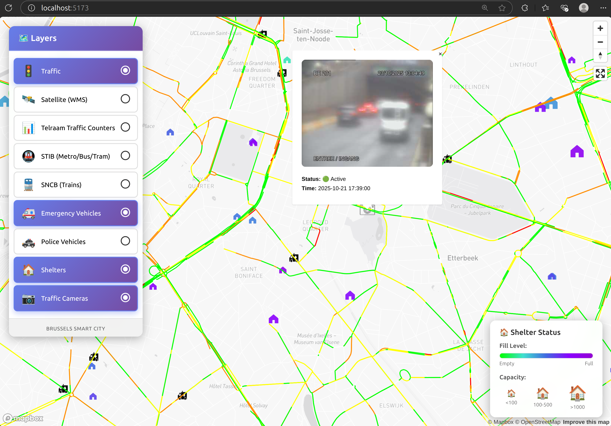
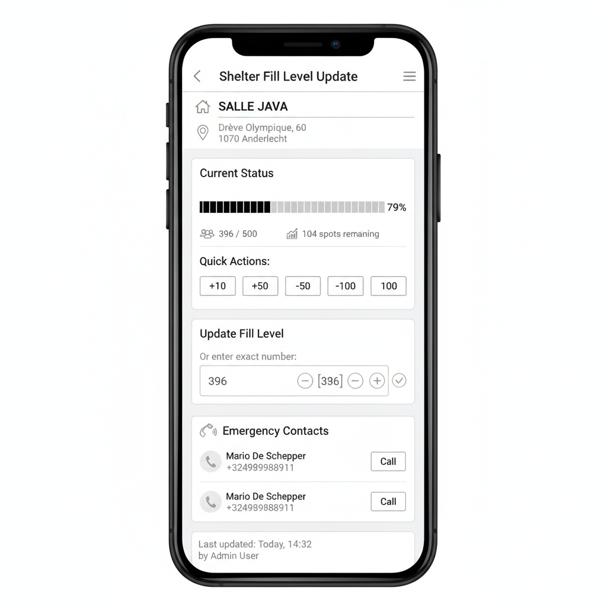

# Brussels Smart City Monitoring Tool

## Overview

The Brussels Smart City Monitoring Tool is a real-time situational awareness platform designed to provide control room operators with a comprehensive view of urban mobility and emergency response across Brussels. Built as a fast, minimalistic, and highly responsive single-page application, it aggregates multiple data sources into an intuitive map-based interface.

The goal is to help people in the control room to have an understanding of the current situation to be able to beter react.

NOTE : CURRENTLY, ALL DATA ARE GENUINE EXCEPT FOR POLICE AND EMERGENCY VEHICULE AS WELL AS THE FILL LEVEL OF THE SHELTERS

The platform could be complemented with a mobile app where first respondant can update some real time metric, for example the number of remaining spot in a shelter.

## Available Data Layers

### 🚦 Traffic
**Type:** Mapbox Traffic (Vector)  
**Update Frequency:** Real-time  
**Source:** Mapbox Traffic API

Displays real-time traffic congestion levels across Brussels road networks:
- **Green:** Low congestion, free-flowing traffic
- **Yellow:** Moderate congestion
- **Orange:** Heavy congestion
- **Red:** Severe congestion or traffic jams

### 🛰️ Satellite (WMS)
**Type:** Sentinel Hub WMS Layers  
**Update Frequency:** Static (imagery from various dates)  
**Source:** Copernicus Sentinel Satellites

Provides satellite imagery and spectral analysis layers from Sentinel-2 satellites. A dropdown menu allows operators to select from multiple visualization products:

**Common Products:**
- **TRUE_COLOR:** Standard RGB satellite imagery
- **FALSE_COLOR:** Vegetation visualization (useful for identifying green spaces)
- **NDVI (Normalized Difference Vegetation Index):** Vegetation health mapping
- **NDWI (Normalized Difference Water Index):** Water body detection
- **SWIR (Short Wave Infrared):** Enhanced terrain visualization
- **AGRICULTURE:** Optimized for agricultural land monitoring
- **MOISTURE_INDEX:** Soil and surface moisture levels
- **URBAN:** Enhanced urban area visualization

*Note: Over 50 spectral analysis products are available through the dropdown selector.*

### 📊 Telraam Traffic Counters
**Type:** Line Features (GeoJSON)  
**Update Frequency:** Every 5 seconds  
**Source:** Mobility Twin Brussels API

Displays hourly vehicle counts on Brussels road segments, sourced from Telraam community traffic counters. Lines are colored by total traffic volume:

**Color Gradient:**
- **Cyan:** Low traffic (0-250 vehicles/hour)
- **Green-Yellow:** Moderate traffic (250-750 vehicles/hour)
- **Orange:** High traffic (750-1500 vehicles/hour)
- **Red:** Very high traffic (1500+ vehicles/hour)

**Interactive Details:** Click any road segment to view:
- 🚴 Bicycle count
- 🚗 Car count
- 🚚 Heavy vehicle count
- 🚶 Pedestrian count
- 📊 Total count

### 🚇 STIB (Metro/Bus/Tram)
**Type:** Point Features with Icons (GeoJSON)  
**Update Frequency:** Every 5 seconds  
**Source:** Mobility Twin Brussels API (GTFS-RT)

Real-time positions of Brussels public transport vehicles. Each vehicle type is represented by a distinct icon:
- **Metro:** Subway icon
- **Tram:** Tram icon
- **Bus:** Bus icon

**Status Colors:**
- **Green:** On-time (85% of vehicles)
- **Orange:** Slightly delayed (10% of vehicles)
- **Red:** Significantly delayed (5% of vehicles)

### 🚆 SNCB (Trains)
**Type:** Point Features with Icons (GeoJSON)  
**Update Frequency:** Every 5 seconds  
**Source:** Mobility Twin Brussels API (GTFS-RT)

Real-time positions of Belgian railway trains in the Brussels region. Similar to STIB, trains are color-coded by their schedule adherence status.

### 🚑 Emergency Vehicles
**Type:** Animated Point Features (GeoJSON)  
**Update Frequency:** Every 1 second (animation)  
**Source:** Local trip simulation data

Displays animated emergency vehicle movements (ambulances, fire trucks) following pre-recorded trip paths. The animation loops continuously, providing a realistic simulation of emergency response patterns.

**Interactive Details:** Click any vehicle to view:
- Vehicle ID
- Current speed
- Heading direction
- Timestamp

### 🚓 Police Vehicles
**Type:** Animated Point Features (GeoJSON)  
**Update Frequency:** Every 1 second (animation)  
**Source:** Local trip simulation data

Similar to emergency vehicles, this layer shows police vehicle movements across Brussels, helping operators track law enforcement response patterns.

### 🏠 Shelters
**Type:** Point Features with Dynamic Icons (GeoJSON)  
**Update Frequency:** Static (loads once)  
**Source:** Local GeoJSON file

Displays emergency shelter locations across Brussels. Icons are:

**Size-coded by Capacity:**
- **Small icons:** <100 capacity
- **Medium icons:** 100-500 capacity
- **Large icons:** 500-1000 capacity
- **Extra-large icons:** 2000+ capacity

**Color-coded by Fill Level:**
- **Green:** Empty or low occupancy (0-25%)
- **Turquoise:** Moderate occupancy (25-50%)
- **Royal Blue:** High occupancy (50-75%)
- **Violet:** Near capacity (75-95%)
- **Purple:** At or over capacity (95-100%)

**Legend:** A dedicated legend appears in the bottom-right corner when the shelter layer is active, showing the color gradient and size scale.

**Interactive Details:** Click any shelter to view:
- Shelter name and type
- Full address
- Total capacity
- Current fill level
- Available spots
- Emergency contact information

### 📷 Traffic Cameras
**Type:** Point Features with Icons (GeoJSON)  
**Update Frequency:** Static (loads once)  
**Source:** Local GeoJSON file

Displays traffic camera locations across Brussels. Each camera marker can be clicked to view:
- Live camera feed (when available)
- Camera status (active/inactive)
- Timestamp of last update
- Location details

---

## How It Works

### Layer Management
1. **Toggle layers** by clicking on them in the layer control panel (top-left)
2. **Active layers** are highlighted with a gradient background and filled indicator
3. **Multiple layers** can be active simultaneously
4. **WMS layer selection** appears when the Satellite layer is activated

### Data Updates
- **Dynamic layers** (STIB, SNCB, Telraam) refresh automatically every 5 seconds
- **Animated layers** (Emergency, Police) update positions every 1 second
- **Static layers** (Shelters, Cameras) load once for optimal performance
- **No loading indicators** to maintain a clean, uninterrupted interface

### Map Navigation
- **Pan:** Click and drag the map
- **Zoom:** Mouse wheel or pinch gesture
- **Navigation controls:** Available in the top-right corner
- **Fullscreen mode:** Toggle from the top-right controls

### Interactive Features
- **Click markers/lines** to view detailed information in popups
- **Hover over layers** to see cursor change indicating interactivity
- **Select WMS products** from the dropdown when satellite layer is active

---

## Technical Architecture

### Frontend Stack
- **Vue 3:** Reactive framework with Composition API
- **Mapbox GL JS:** High-performance map rendering
- **Vite:** Fast development and build tool

### Data Sources
- **Mobility Twin Brussels API:** Real-time transit and traffic data
- **Sentinel Hub WMS:** Satellite imagery and spectral analysis
- **Local GeoJSON files:** Static infrastructure data (shelters, cameras)
- **Simulated trip data:** Emergency and police vehicle animations

### Performance Optimizations
- **Lazy loading:** Data is preloaded on map initialization to prevent flicker
- **Caching:** Static layers are loaded once and cached in memory
- **Debounced updates:** Auto-refresh intervals optimized for performance
- **Efficient rendering:** Mapbox GL's vector tile rendering for smooth performance

---

## Use Cases

### Emergency Response Coordination
- Monitor emergency vehicle locations and response times
- Identify available shelter capacity during crises
- Track traffic congestion to optimize emergency routes

### Traffic Management
- Real-time traffic flow monitoring via Telraam counters
- Public transport performance tracking
- Incident detection through camera feeds

### Urban Planning & Analysis
- Long-term traffic pattern analysis
- Public transport utilization trends
- Satellite imagery for infrastructure planning

### Situational Awareness
- Comprehensive overview of urban mobility systems
- Multi-modal transportation monitoring
- Critical infrastructure status at a glance